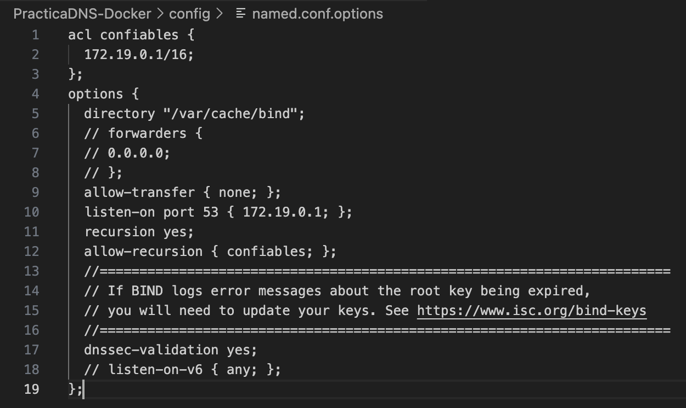
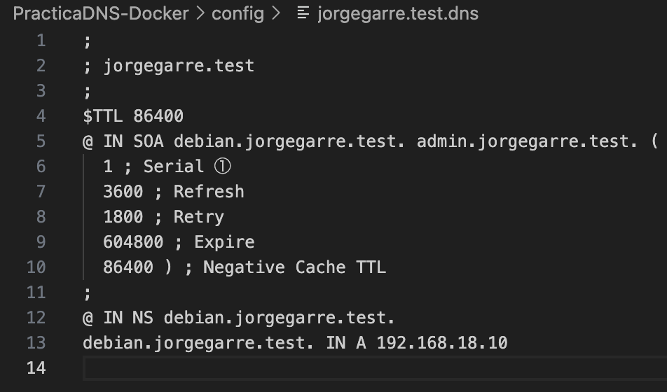

# Documentación Practica DNS con Docker

**Autor:** Jorge Garre Corrales

### 1. Crear fichero docker-compose.yml

### 2. Ficheros de configuración del servidor

Este es el comando que he usado para ver la IP del contenedor

Estos son los ficheros que nos hacen falta

1. named.conf
2. named.conf.options
3. named.conf.local
4. jorgegarre.test.dns
5. jorgegarre.test.rev

#### 2.1 Fichero named.conf

Este fichero ya viene configurado correctamente en esta imagen ya que viene con el paquete de bind, este es el comando que he ejecutado para comprobar el fichero

#### 2.2 Fichero named.conf.options

He copiado el fichero de el contenedor a mi carpeta config

Y lo he configurado de la siguiente forma

