# Documentación Practica DNS con Docker

**Autor:** Jorge Garre Corrales

##  Índice

1. [Crear fichero docker-compose.yml](#1-crear-fichero-docker-composeyml)
2. [Ficheros de configuración del servidor](#2-ficheros-de-configuración-del-servidor)
   - [2.1 Fichero named.conf](#21-fichero-namedconf)
   - [2.2 Fichero named.conf.options](#22-fichero-namedconfoptions)
   - [2.3 Fichero named.conf.local](#23-fichero-namedconflocal)
   - [2.4 Fichero jorgegarre.test.dns](#24-fichero-jorgegarretestdns)
   - [2.5 Fichero jorgegarre.test.rev](#25-fichero-jorgegarretestrev)
3. [Comprobaciones](#3-comprobaciones)

### 1. Crear fichero docker-compose.yml

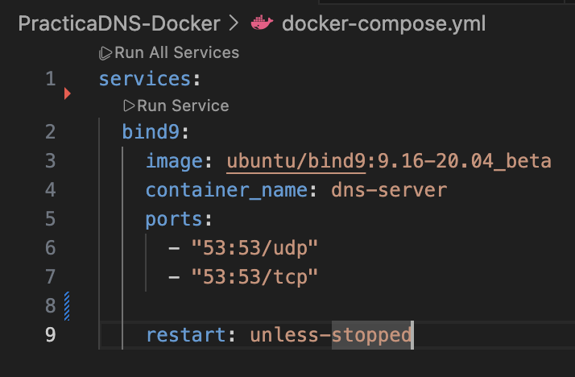

### 2. Ficheros de configuración del servidor

Este es el comando que he usado para ver la IP del contenedor

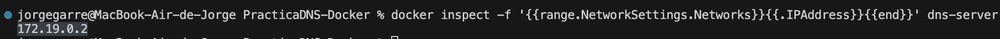

Estos son los ficheros que nos hacen falta

1. named.conf
2. named.conf.options
3. named.conf.local
4. jorgegarre.test.dns
5. jorgegarre.test.rev

#### 2.1 Fichero named.conf

Este fichero ya viene configurado correctamente en esta imagen ya que viene con el paquete de bind, este es el comando que he ejecutado para comprobar el fichero

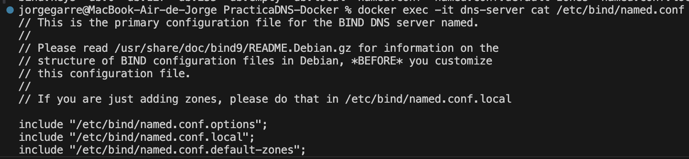

#### 2.2 Fichero named.conf.options

He copiado el fichero de el contenedor a mi carpeta config

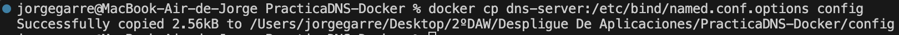

Y lo he configurado de la siguiente forma

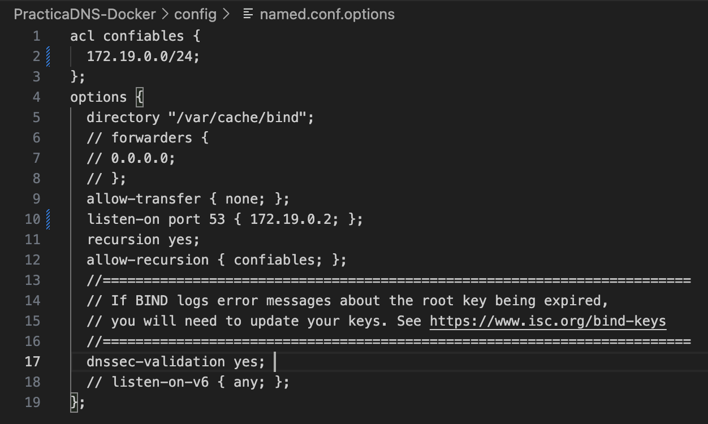

Mas tarde al hacer las comprobaciones de la configuración lo lograba conectarme al contenedor por lo que tuve que cambiar la linea listen-on port 53 { 172.19.0.2; }; por lo siguiente para que pudiera acceder desde la IP de mi ordenador

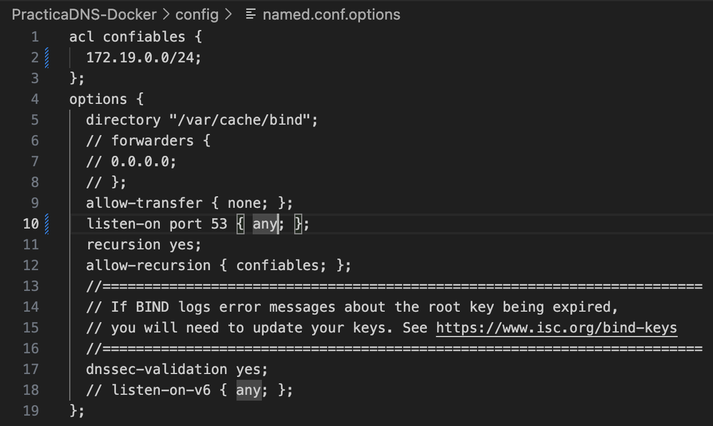

#### 2.3 Fichero named.conf.local

He copiado el fichero del contenedor y le he puesto la siguiente configuración

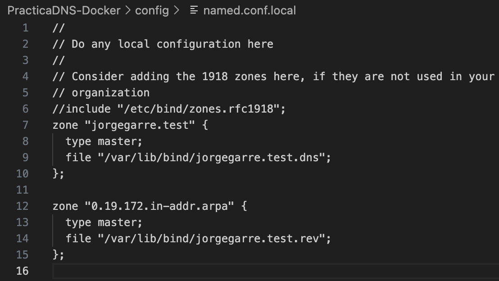

#### 2.4 Fichero jorgegarre.test.dns

He creado el fichero y le he puesto la siguiente configuración

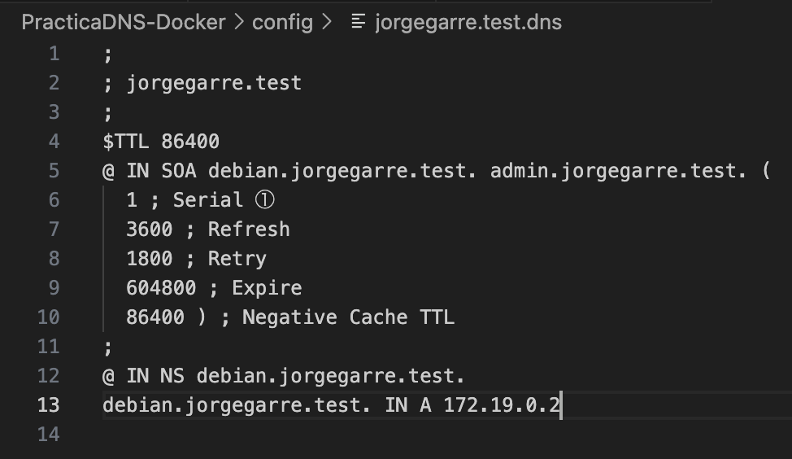

#### 2.5 Fichero jorgegarre.test.rev

He creado el fichero y le he puesto la siguiente configuración

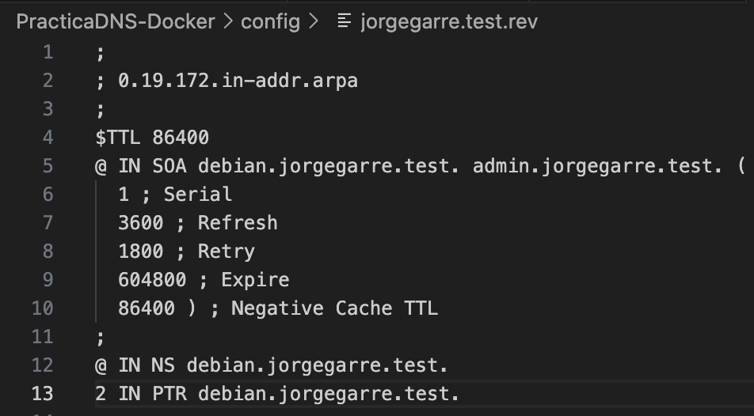

Y por ultimo debemos de pasarle los ficheros de configuración al contenedor, para ello he añadido la siguiente configuración al fichero docker-compose.yml

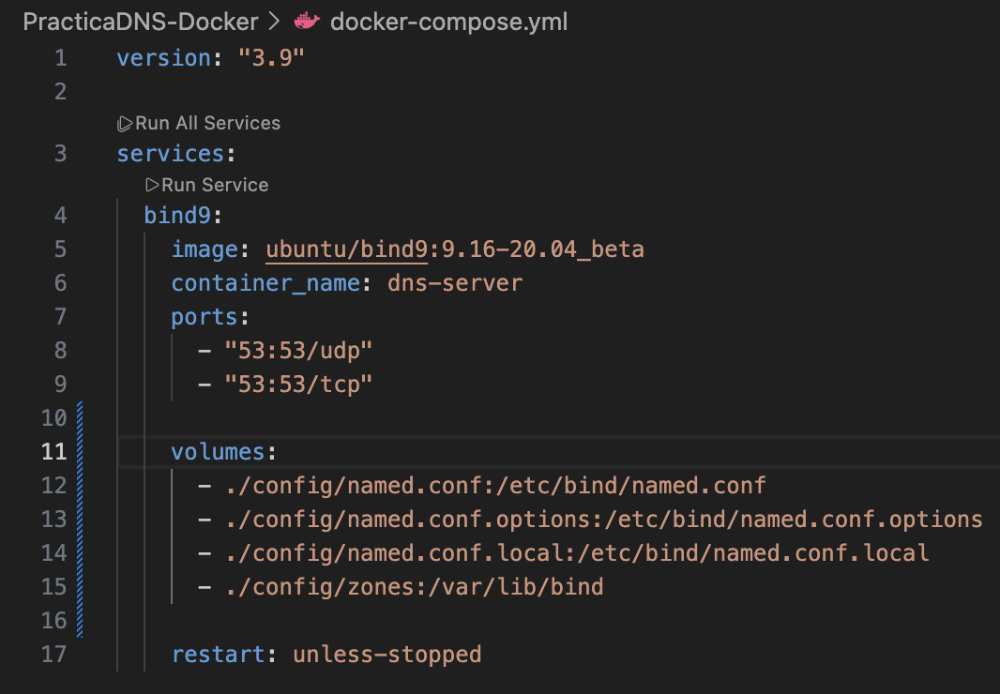

### 3. Comprobaciones

Para hacer las comprobaciones he accedido a la terminal de el contenedor Docker con el siguiente comando

Comprobación de fichero named.conf

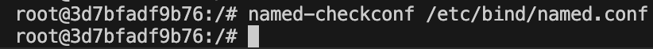

Comprobación de jorgegarre.test.dns (Zona directa)

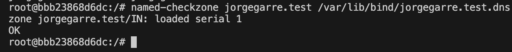

Comprobación de jorgegarre.test.rev (Zona inversa)

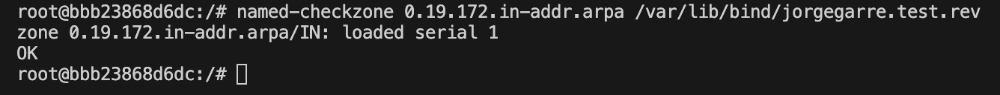

Comprobación con dig

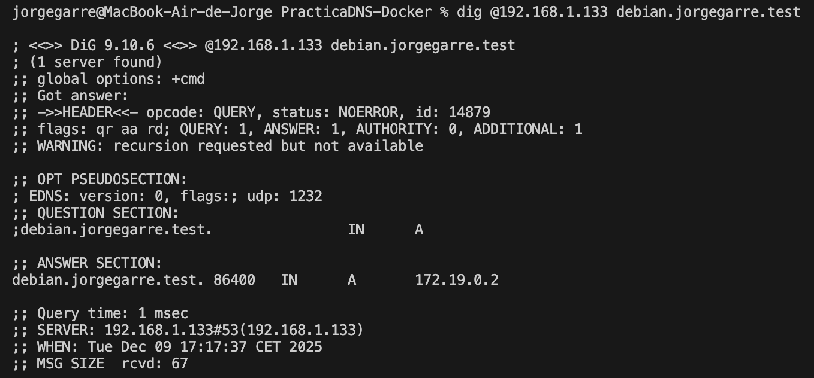

Comprobación inversa

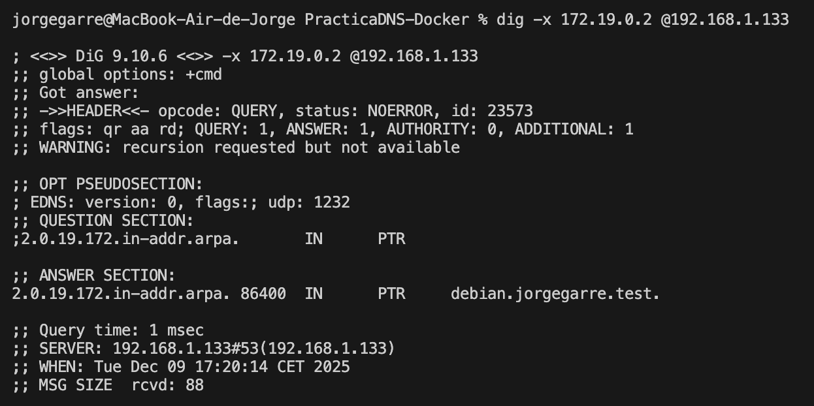

Comprobación con nslookup

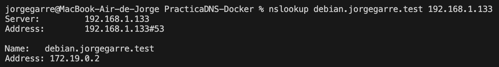
